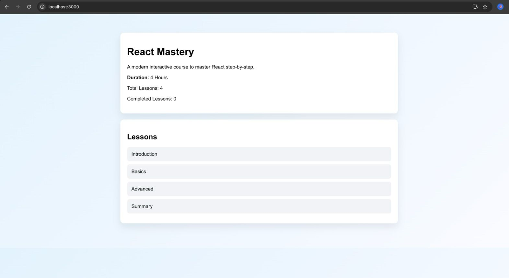

# 🎓 React LMS Frontend

A modern and interactive **Learning Management System (LMS)** built using **React**.  
This application allows users to explore courses, view lessons, and navigate through structured learning content with a clean and responsive UI.

---

## 🚀 Features

- 📚 Course listing with details  
- 📖 Lesson-wise structured learning  
- 🧭 Simple and intuitive navigation  
- 🎨 Clean and modern UI using CSS  
- ⚡ Fast and responsive React frontend  

---

## 🛠️ Technologies Used

- **React JS**
- **JavaScript**
- **HTML5**
- **CSS3**

---

## 📸 Application Screenshots

### Course Overview


### Lesson List


### Inside Course


### Home Page


---

## 📦 Installation & Run

To run this project locally:

```bash
git clone https://github.com/Harini1507/lms-react.git
cd lms-react
npm install
npm start
